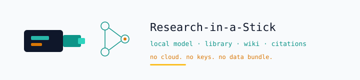

# Research-in-a-Stick



Students burn money on data bundles just to look up a concept, pull a citation, or open Wikipedia. Research-in-a-Stick puts a full research desk on a USB stick so a cheap laptop can do that work with the network cable unplugged.

**Hard constraint it answers:** offline labs and campus Wi‑Fi that drops mid-assignment. Zero cloud calls, zero API keys, zero accounts. Files stay on the stick.

## How it works

1. Plug the stick into a Windows PC and run `launcher.bat`.
2. A local server opens at `http://127.0.0.1:8765`. The chat UI is the front door.
3. A small local model (Qwen2.5‑0.5B via llama.cpp) answers questions on device. First reply takes 15–40s while the model wakes up.
4. Document RAG pulls passages from PDFs, TXT, MD, and CSV you drop on the stick.
5. Citations export in APA, Vancouver, or Harvard. CSV tools and a small skills kit (math, Python run, file organize) sit beside the chat.
6. Offline wiki (Kiwix + ZIM) serves Wikipedia-style packs without a network.

| Module | What you get |
| --- | --- |
| Local LLM | Qwen2.5‑0.5B through llama.cpp, auto-load with watchdog |
| Chat UI | Conversational-first, Ollama-style |
| Knowledge library | Health, agri, curriculum, policy seed packs |
| Document RAG | PDF / TXT / MD / CSV retrieval |
| Offline wiki | Kiwix + ZIM (small pack shipped; full Wikipedia optional) |
| Citations | APA · Vancouver · Harvard |
| CSV analysis | Summaries for methods sections |
| Skills | Math, Python run, file organize |
| Portable Python | Runs from the stick |
| Cloud / API keys | None. Design constraint. |

## Stack

Python 3 (portable on stick) · stdlib HTTP server · llama.cpp + Qwen2.5‑0.5B · Kiwix (`kiwix-serve`) · static HTML/CSS/JS dashboard · Batchfile launchers for Windows.

## Run locally

On a Windows PC with the stick mounted (or a clone of this repo):

```bat
launcher.bat
```

That opens `http://127.0.0.1:8765`. If chat looks stuck, hard-refresh the browser, run `check_model.bat`, then start `launcher.bat` again.

From source without the stick image:

```bash
python start.py
# options: --host 127.0.0.1 --port 8765 --no-browser
```

Needs Python 3 and a model under `models/` with the llama.cpp binaries under `bin/win-x64/`. `check_model.bat` verifies that layout.

Smoke tests live in `tests/smoke_test.py` and `tests/smoke_local.py`.

## Product site

`site/index.html` is the offline landing page shipped on the stick. Open it in any browser to read the pitch without starting the server. `DESIGN.md` holds the visual and voice rules for that page. Business plan and pitch outline sit in `BUSINESS_PLAN.md` and `PITCH_DECK_OUTLINE.md`.

## Links

- Profile: [shadrackb1](https://github.com/shadrackb1)
- Related: [playground RIS lab](https://shadrackb1.github.io/playground/ris-lab.html) (browser mock of the ingest → retrieve → cite loop)
- Related: [juriscore](https://github.com/shadrackb1/juriscore) for online legal research when the network is up

## License

See repository license terms. Contact via the profile for pilot partnerships.
